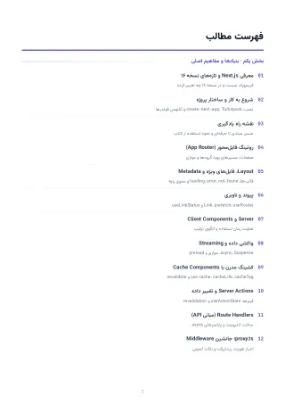
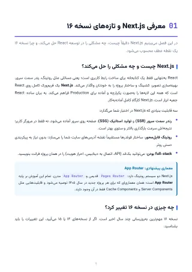
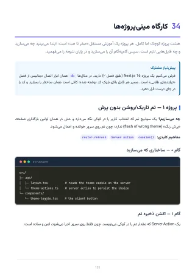

<a id="top"></a>

<p align="center">
  
</p>

<p align="center" dir="rtl">
  <strong>از App Router و Server Components تا معماری و استقرار</strong>
  <br>
  راهنمای فارسی و پروژه‌محور Next.js 16؛ با تمرکز بر رندر سرور، Cache Components، Server Actions، امنیت، تست و Production.
</p>

<p align="center">
  <a href="https://rezaian-dev.github.io/nextjs-16-persian-guide/"></a>
  <a href="./docs/pdf/Nextjs16-Persian-Guide.pdf"></a>
  <a href="./docs/pdf/Nextjs16-Persian-Guide.epub"></a>
</p>

<p align="center">
  
  
  
  
  
</p>

<p align="center" dir="rtl">
  <a href="#about">درباره</a> ·
  <a href="#path">مسیر یادگیری</a> ·
  <a href="#chapters">فهرست فصل‌ها</a> ·
  <a href="#preview">پیش‌نمایش</a> ·
  <a href="#editions">نسخه‌ها</a> ·
  <a href="#build">ساخت از سورس</a> ·
  <a href="#collection">مجموعه</a>
</p>

---

<div dir="rtl">

<a id="about"></a>

## درباره راهنما

مرجع فارسی Next.js 16 در ۳۷ فصل؛ از App Router و Server Components تا Cache Components، امنیت، تست، Core Web Vitals و استقرار. رایگان: نسخهٔ آنلاین، PDF و EPUB.

این راهنما بر **مدل ذهنی، تحلیل رفتار و تصمیم‌گیری فنی** تمرکز دارد. هدف این نیست که مجموعه‌ای از APIها حفظ شود؛ هدف این است که بتوانید مسئله را بفهمید، راه‌حل را ارزیابی کنید و کدی بنویسید که در پروژهٔ واقعی قابل نگهداری باشد.

### ویژگی‌ها

- **مدل ذهنی App Router:** مرز سرور و کلاینت، رندر، Streaming و Hydration با تمرکز بر چرایی تصمیم‌های فریم‌ورک.
- **همگام با Next.js 16:** Cache Components، use cache، cacheLife، cacheTag، Turbopack، proxy.ts و React 19.2.
- **کد TypeScript و پروژهٔ واقعی:** ۲۱۶ پنجرهٔ کد و ترمینال، یک مینی‌بالگ کامل و ۸ پروژهٔ کوچک برای تمرین مرحله‌ای.
- **معماری و داده:** ساختار feature-based، DAL، Route Handlers، Server Actions، مدیریت state و اعتبارسنجی.
- **Production از ابتدا:** احراز هویت، RBAC، امنیت، rate limit، تست، Core Web Vitals، Docker و Self-Hosting.
- **مهاجرت و مرجع سریع:** مسیر ارتقا به نسخهٔ ۱۶، خطاهای رایج، پرسش‌های مصاحبه و واژه‌نامهٔ فارسی–انگلیسی.

<a id="path"></a>

## مسیر یادگیری

### ۱. بنیادها و اولین اپ

**فصل‌های ۱ تا ۱۶** — راه‌اندازی، App Router، Layout، RSC، داده، Streaming، کشینگ، Server Actions و پروژهٔ مینی‌بالگ.

دستاورد: **ساخت مدل ذهنی و درک رفتار پایه**

### ۲. معماری و Production

**فصل‌های ۱۷ تا ۳۲** — رندر، API، Hydration، احراز هویت، امنیت، فرم، کشینگ پیشرفته، سئو، تست، استقرار و مهاجرت.

دستاورد: **تسلط بر الگوها و قابلیت‌های مدرن**

### ۳. کارگاه و تثبیت

**فصل‌های ۳۳ تا ۳۵** — نکات طلایی، کارگاه ۸ مینی‌پروژه و مرور بهترین شیوه‌ها و اشتباهات رایج.

دستاورد: **طراحی کد پایدار و قابل نگهداری**

### ۴. مرجع و آمادگی شغلی

**فصل‌های ۳۶ تا ۳۷** — پرسش‌های مصاحبه با پاسخ دقیق و واژه‌نامهٔ فارسی–انگلیسی برای مرور سریع.

دستاورد: **تثبیت آموخته‌ها و آمادگی پروژه**

> برای مطالعهٔ پیوسته از بخش اول شروع کنید. اگر تجربهٔ عملی دارید، می‌توانید مستقیماً به مرحلهٔ متناسب با نیاز فعلی خود بروید.

<a id="chapters"></a>

## فهرست فصل‌ها

فهرست کامل در چهار بخش جمع شده است تا صفحه خلوت بماند. برای مشاهدهٔ فصل‌ها، هر بخش را باز کنید.

<details>
<summary><strong>بخش اول — بنیادها و اولین اپ</strong> · فصل‌های ۱ تا ۱۶</summary>

1. [معرفی Next.js 16 و تازه‌های نسخه](./docs/pdf/Nextjs16-Persian-Guide.pdf#page=5) — صفحهٔ ۵
2. [شروع به کار و ساختار پروژه](./docs/pdf/Nextjs16-Persian-Guide.pdf#page=7) — صفحهٔ ۷
3. [نقشه راه یادگیری](./docs/pdf/Nextjs16-Persian-Guide.pdf#page=9) — صفحهٔ ۹
4. [روتینگ فایل‌محور (App Router)](./docs/pdf/Nextjs16-Persian-Guide.pdf#page=11) — صفحهٔ ۱۱
5. [Layout، فایل‌های ویژه و Metadata](./docs/pdf/Nextjs16-Persian-Guide.pdf#page=19) — صفحهٔ ۱۹
6. [پیوند و ناوبری](./docs/pdf/Nextjs16-Persian-Guide.pdf#page=23) — صفحهٔ ۲۳
7. [Server Components و Client Components](./docs/pdf/Nextjs16-Persian-Guide.pdf#page=29) — صفحهٔ ۲۹
8. [واکشی داده و Streaming](./docs/pdf/Nextjs16-Persian-Guide.pdf#page=36) — صفحهٔ ۳۶
9. [کشینگ مدرن با Cache Components](./docs/pdf/Nextjs16-Persian-Guide.pdf#page=45) — صفحهٔ ۴۵
10. [Server Actions و تغییر داده](./docs/pdf/Nextjs16-Persian-Guide.pdf#page=51) — صفحهٔ ۵۱
11. [Route Handlers (مبانی API)](./docs/pdf/Nextjs16-Persian-Guide.pdf#page=56) — صفحهٔ ۵۶
12. [Middleware؛ جانشین proxy.ts](./docs/pdf/Nextjs16-Persian-Guide.pdf#page=60) — صفحهٔ ۶۰
13. [استایل‌دهی با Tailwind v4](./docs/pdf/Nextjs16-Persian-Guide.pdf#page=62) — صفحهٔ ۶۲
14. [بهینه‌سازی: تصویر، فونت، لینک و سئو](./docs/pdf/Nextjs16-Persian-Guide.pdf#page=64) — صفحهٔ ۶۴
15. [محیط، TypeScript و استقرار](./docs/pdf/Nextjs16-Persian-Guide.pdf#page=66) — صفحهٔ ۶۶
16. [پروژه عملی: مینی‌بالگ کامل](./docs/pdf/Nextjs16-Persian-Guide.pdf#page=70) — صفحهٔ ۷۰

</details>

<details>
<summary><strong>بخش دوم — معماری و Production</strong> · فصل‌های ۱۷ تا ۳۲</summary>

17. [معماری پروژه، ساختار پوشه و Clean Code](./docs/pdf/Nextjs16-Persian-Guide.pdf#page=74) — صفحهٔ ۷۴
18. [استراتژی‌های رندر: SSG، ISR، SSR و PPR](./docs/pdf/Nextjs16-Persian-Guide.pdf#page=78) — صفحهٔ ۷۸
19. [API‌نویسی کامل با Route Handlers](./docs/pdf/Nextjs16-Persian-Guide.pdf#page=84) — صفحهٔ ۸۴
20. [خطاهای Hydration — مرجع کامل](./docs/pdf/Nextjs16-Persian-Guide.pdf#page=94) — صفحهٔ ۹۴
21. [احراز هویت و کنترل دسترسی](./docs/pdf/Nextjs16-Persian-Guide.pdf#page=102) — صفحهٔ ۱۰۲
22. [امنیت اپلیکیشن — فصل کامل](./docs/pdf/Nextjs16-Persian-Guide.pdf#page=106) — صفحهٔ ۱۰۶
23. [فرم‌ها و اعتبارسنجی پیشرفته](./docs/pdf/Nextjs16-Persian-Guide.pdf#page=112) — صفحهٔ ۱۱۲
24. [مدیریت state و داده در کلاینت](./docs/pdf/Nextjs16-Persian-Guide.pdf#page=117) — صفحهٔ ۱۱۷
25. [تسلط بر کشینگ: لایه‌ها و باطل‌سازی](./docs/pdf/Nextjs16-Persian-Guide.pdf#page=121) — صفحهٔ ۱۲۱
26. [کارایی و Core Web Vitals](./docs/pdf/Nextjs16-Persian-Guide.pdf#page=125) — صفحهٔ ۱۲۵
27. [Metadata و سئو — کامل](./docs/pdf/Nextjs16-Persian-Guide.pdf#page=128) — صفحهٔ ۱۲۸
28. [TypeScript پیشرفته و امنیت تایپ](./docs/pdf/Nextjs16-Persian-Guide.pdf#page=132) — صفحهٔ ۱۳۲
29. [مدیریت خطا — کامل](./docs/pdf/Nextjs16-Persian-Guide.pdf#page=135) — صفحهٔ ۱۳۵
30. [تست‌نویسی](./docs/pdf/Nextjs16-Persian-Guide.pdf#page=139) — صفحهٔ ۱۳۹
31. [استقرار حرفه‌ای و Self-Hosting](./docs/pdf/Nextjs16-Persian-Guide.pdf#page=142) — صفحهٔ ۱۴۲
32. [مهاجرت و ارتقا به نسخه ۱۶](./docs/pdf/Nextjs16-Persian-Guide.pdf#page=146) — صفحهٔ ۱۴۶

</details>

<details>
<summary><strong>بخش سوم — کارگاه و تثبیت</strong> · فصل‌های ۳۳ تا ۳۵</summary>

33. [نکات و ترفندهای طلایی](./docs/pdf/Nextjs16-Persian-Guide.pdf#page=149) — صفحهٔ ۱۴۹
34. [کارگاه مینی‌پروژه‌ها](./docs/pdf/Nextjs16-Persian-Guide.pdf#page=155) — صفحهٔ ۱۵۵
35. [بهترین شیوه‌ها، اشتباهات رایج و منابع](./docs/pdf/Nextjs16-Persian-Guide.pdf#page=172) — صفحهٔ ۱۷۲

</details>

<details>
<summary><strong>بخش چهارم — مرجع و آمادگی شغلی</strong> · فصل‌های ۳۶ تا ۳۷</summary>

36. [پرسش‌های مصاحبه (Junior تا Senior)](./docs/pdf/Nextjs16-Persian-Guide.pdf#page=174) — صفحهٔ ۱۷۴
37. [واژه‌نامه فارسی–انگلیسی](./docs/pdf/Nextjs16-Persian-Guide.pdf#page=176) — صفحهٔ ۱۷۶

</details>

<a id="preview"></a>

## پیش‌نمایش

<p align="center">
  <a href="./docs/assets/page-toc.png"></a>
  <a href="./docs/assets/page-chapter.png"></a>
  <a href="./docs/assets/page-code.png"></a>
  <a href="./docs/assets/page-workshop.png"></a>
</p>

<a id="editions"></a>

## نسخه‌های در دسترس

### ONLINE — [نسخهٔ آنلاین](https://rezaian-dev.github.io/nextjs-16-persian-guide/book/)

**۱۷۸ صفحه · ۳۷ فصل** — خواندن کامل کتاب در مرورگر، بدون دانلود؛ با فهرست فصل‌ها و پیوند مستقیم به هر فصل (مثلاً [فصل ۲۳](https://rezaian-dev.github.io/nextjs-16-persian-guide/book/#ch-23)).

### PDF — [نسخهٔ اصلی](./docs/pdf/Nextjs16-Persian-Guide.pdf)

**۱۷۸ صفحه · A4** — نسخهٔ رنگی، قابل جست‌وجو و دارای فهرست داخلی برای مطالعه روی دسکتاپ و تبلت.

### EPUB — [نسخهٔ کتاب‌خوان](./docs/pdf/Nextjs16-Persian-Guide.epub)

**راست‌به‌چپ · مناسب موبایل** — صفحه‌های کتاب، فصل‌بندی‌شده برای موبایل، تبلت و نرم‌افزارهای مطالعه EPUB.

### GITHUB — [سورس ابزارها](https://github.com/rezaian-dev/nextjs-16-persian-guide)

**Python · CC BY-NC-SA** — ابزارهای ساخت نسخه‌ها، دارایی‌ها و کنترل کیفیت در مخزن عمومی.

<a id="build"></a>

## ساخت از سورس

پیش‌نیاز اصلی Python 3.10 یا جدیدتر است. ابزارهای این مخزن لایهٔ ناوبری، تصاویر پیش‌نمایش و کنترل کیفیت نسخهٔ نهایی را بازتولید می‌کنند.

### راه‌اندازی

```bash
git clone https://github.com/rezaian-dev/nextjs-16-persian-guide.git
cd nextjs-16-persian-guide

python -m venv .venv
source .venv/bin/activate       # macOS / Linux
# .venv\Scripts\Activate.ps1   # Windows PowerShell

python -m pip install -r src/requirements.txt
python src/tools/build_edition.py
python src/tools/build_epub.py      # EPUB
python src/tools/build_reader.py    # نسخهٔ آنلاین در docs/book/
python src/tools/make_previews.py
python src/tools/make_shots.py
python src/tools/make_card.py
python src/tools/qa.py
```

### ساختار اصلی

```text
.
├── docs/                       # سایت و نسخه نهایی کتاب
│   ├── assets/
│   ├── index.html
│   └── pdf/
└── src/
    ├── edition/chapters.json   # منبع ساختاری فصل‌ها
    ├── banner/
    └── tools/                  # ساخت، پیش‌نمایش و QA
```

<a id="collection"></a>

## مجموعه راهنماهای فارسی

این چهار مرجع یک مسیر هماهنگ می‌سازند: نسخه‌بندی و همکاری، زبان JavaScript، رابط کاربری React، و فریم‌ورک Production با Next.js.

- **[Git و GitHub ۲۰۲۶](https://github.com/rezaian-dev/git-github-persian-guide)** — نسخه‌بندی، VS Code و همکاری · [نسخه آنلاین](https://rezaian-dev.github.io/git-github-persian-guide/)
- **[JavaScript ES2025](https://github.com/rezaian-dev/javascript-persian-guide)** — زبان و مدل ذهنی · [نسخه آنلاین](https://rezaian-dev.github.io/javascript-persian-guide/)
- **[React 19.2](https://github.com/rezaian-dev/react-19-persian-guide)** — رابط کاربری، state و معماری کامپوننت · [نسخه آنلاین](https://rezaian-dev.github.io/react-19-persian-guide/)
- **[Next.js 16](https://github.com/rezaian-dev/nextjs-16-persian-guide)** — فریم‌ورک، رندر سرور و استقرار · [نسخه آنلاین](https://rezaian-dev.github.io/nextjs-16-persian-guide/) — **راهنمای فعلی**

## مشارکت

برای گزارش خطا یا پیشنهاد اصلاح، یک [Issue](https://github.com/rezaian-dev/nextjs-16-persian-guide/issues) باز کنید. Pull Requestها بهتر است کوچک، متمرکز و همراه با توضیح روشن دربارهٔ دلیل تغییر باشند.

- [گزارش یک مشکل](https://github.com/rezaian-dev/nextjs-16-persian-guide/issues)
- [مشاهده مخزن](https://github.com/rezaian-dev/nextjs-16-persian-guide)

## نویسنده و مجوز

**محمدرضا رضائیان** — [@rezaian-dev](https://github.com/rezaian-dev)

این اثر با مجوز [Creative Commons BY-NC-SA 4.0](./LICENSE) منتشر شده است. استفاده و بازنشر غیرتجاری با ذکر منبع مجاز است و نسخهٔ اقتباسی باید با همین مجوز منتشر شود.

</div>

---

<p align="center" dir="rtl">
  اگر این راهنما برایتان مفید بود، با ثبت یک ⭐ از ادامهٔ توسعهٔ مجموعه حمایت کنید.
  <br>
  <a href="#top">بازگشت به بالا</a>
</p>
