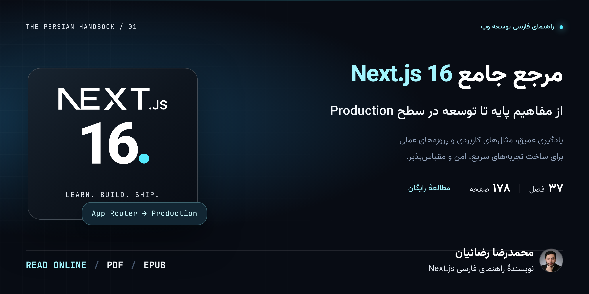
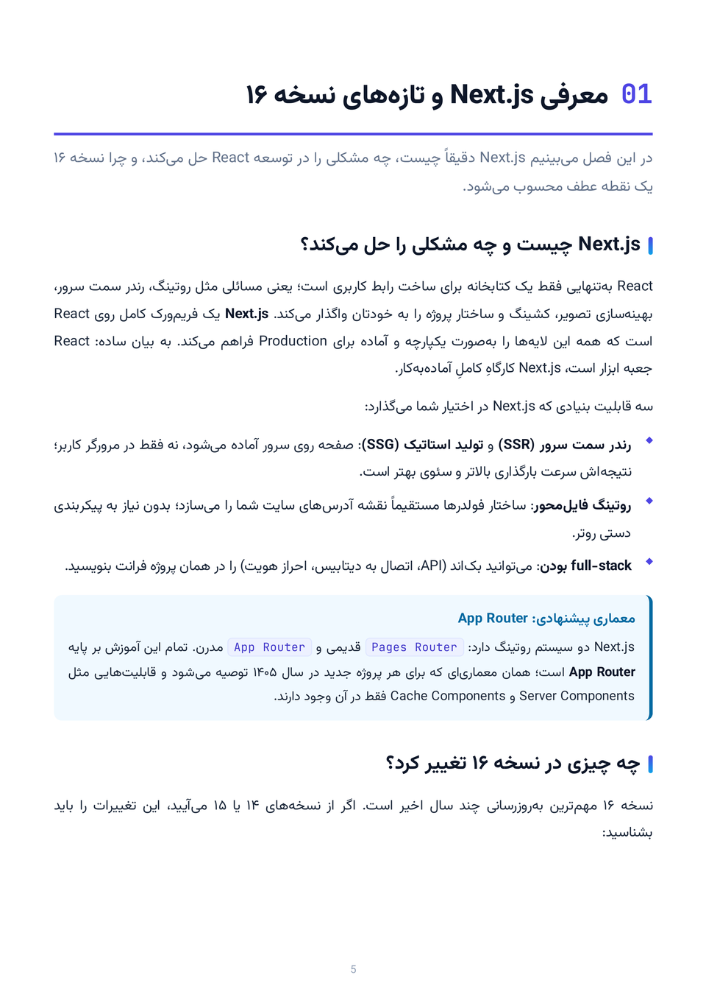
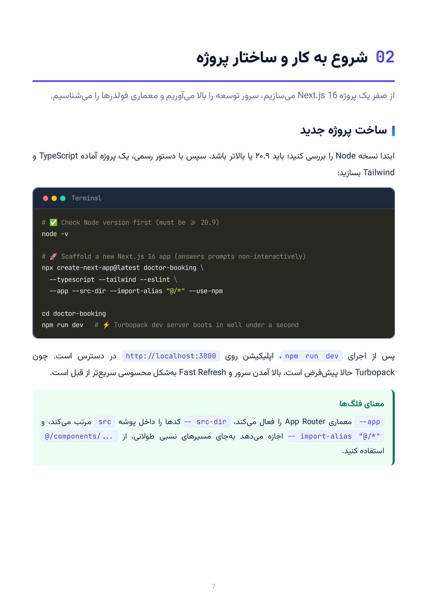

# 📘 مرجع جامع Next.js 16

### راهنمای فارسی از مقدماتی تا سطح Production

**۳۷ فصل · ۱۷۸ صفحه · ویرایش ۱.۰.۰**

از اولین قدم در App Router تا معماری، امنیت و استقرار اپلیکیشن‌های واقعی.

[🌐 مطالعهٔ آنلاین](https://rezaian-dev.github.io/nextjs-16-persian-guide/book/) · [📑 فهرست فصل‌ها](https://rezaian-dev.github.io/nextjs-16-persian-guide/chapters/) · [📕 دریافت PDF](https://rezaian-dev.github.io/nextjs-16-persian-guide/pdf/Nextjs16-Persian-Guide.pdf) · [📗 دریافت EPUB](https://rezaian-dev.github.io/nextjs-16-persian-guide/pdf/Nextjs16-Persian-Guide.epub)

---

## 📖 دربارهٔ این کتاب

**مرجع جامع Next.js 16** راهنمایی فارسی برای یادگیری مفاهیم، قابلیت‌ها و شیوه‌های توسعه با Next.js 16 و React 19.2 است؛ از مسیریابی و رندر گرفته تا مدیریت داده، کشینگ و آماده‌سازی یک اپلیکیشن برای استفادهٔ واقعی.

مسیر کتاب از مفاهیم پایه شروع می‌شود و به موضوعات پیشرفته می‌رسد. در کنار توضیح قابلیت‌ها، نمونه‌کدها، پروژه‌های عملی و نکات کاربردی کمک می‌کنند ارتباط میان مفاهیم را در عمل ببینید؛ نه اینکه فقط نام APIها را به خاطر بسپارید.

## 🎯 این راهنما برای چه کسانی است؟

- **توسعه‌دهندگان آشنا با React** که می‌خواهند یادگیری Next.js را با مسیری منظم شروع کنند.
- **کاربران نسخه‌های قبلی Next.js** که به دنبال شناخت تغییرات نسخهٔ ۱۶ و مسیر مهاجرت هستند.
- **توسعه‌دهندگان باتجربه‌تر** که می‌خواهند در معماری، کارایی، امنیت و استقرار عمیق‌تر شوند.
- **افراد در حال آماده‌شدن برای مصاحبه** که به مرور مفاهیم و پرسش‌های فنی نیاز دارند.

آشنایی مقدماتی با JavaScript، React و مفاهیم وب به درک بهتر مطالب کمک می‌کند.

## 🗺️ در کتاب چه می‌خوانید؟

### 🌱 ۱. بنیادها و مفاهیم اصلی — فصل‌های ۱ تا ۱۶

آشنایی با Next.js 16، شروع به کار، App Router، Layout و فایل‌های ویژه، ناوبری، Server و Client Components، واکشی داده و Streaming، کشینگ مدرن، Server Actions، Route Handlers، استایل‌دهی و بهینه‌سازی؛ همراه با پروژهٔ عملی مینی‌بلاگ.

[شروع بخش اول](https://rezaian-dev.github.io/nextjs-16-persian-guide/book/#ch-01)

### 🏗️ ۲. معماری و مباحث پیشرفته — فصل‌های ۱۷ تا ۳۲

معماری و سازمان‌دهی کد، استراتژی‌های رندر، APIنویسی، خطاهای Hydration، احراز هویت و کنترل دسترسی، امنیت، فرم‌ها و اعتبارسنجی، مدیریت state، لایه‌های کش، Core Web Vitals، سئو، TypeScript پیشرفته، مدیریت خطا، تست، استقرار و مهاجرت به نسخهٔ ۱۶.

[شروع بخش دوم](https://rezaian-dev.github.io/nextjs-16-persian-guide/book/#ch-17)

### 🛠️ ۳. جمع‌بندی و کارگاه — فصل‌های ۳۳ تا ۳۵

نکات و ترفندهای کاربردی، هشت مینی‌پروژه برای تمرین، بهترین شیوه‌ها، اشتباهات رایج و منابع ادامهٔ یادگیری.

[شروع بخش سوم](https://rezaian-dev.github.io/nextjs-16-persian-guide/book/#ch-33)

### 🎓 ۴. پیوست‌ها — فصل‌های ۳۶ و ۳۷

پرسش‌های مصاحبه از سطح Junior تا Senior و واژه‌نامهٔ فارسی–انگلیسی برای مرور اصطلاحات کلیدی.

[شروع پیوست‌ها](https://rezaian-dev.github.io/nextjs-16-persian-guide/book/#ch-36)

## ✨ ویژگی‌های راهنما

- ⚡ **تمرکز بر Next.js 16:** از Cache Components و `use cache` تا Server Actions و قابلیت‌های مرتبط با React 19.2.
- 🧩 **یادگیری همراه با تمرین:** نمونه‌کد، مینی‌بلاگ و کارگاه مینی‌پروژه‌ها در کنار توضیح مفاهیم.
- 🛡️ **توجه به نیازهای واقعی توسعه:** امنیت، احراز هویت، کارایی، تست و استقرار در کنار مباحث پایه.
- 🔎 **مرجع فارسی برای مرور:** فصل‌بندی موضوعی، پرسش‌های مصاحبه و واژه‌نامهٔ دوزبانه.
- 🎁 **دسترسی رایگان:** مطالعه در مرورگر یا دریافت نسخهٔ کتاب برای مطالعهٔ آفلاین.

## 🖼️ نگاهی به صفحات کتاب

## 🚀 چطور مطالعه را شروع کنید؟

اگر تازه وارد Next.js شده‌اید، از بخش اول شروع کنید و تمرین‌ها را همراه با مطالعه انجام دهید. اگر تجربهٔ قبلی دارید، از [فهرست کامل فصل‌ها](https://rezaian-dev.github.io/nextjs-16-persian-guide/chapters/) موضوع موردنیازتان را انتخاب کنید؛ فصل مهاجرت نیز نقطهٔ شروع مناسبی برای مرور تغییرات نسخهٔ ۱۶ است.

| نسخه | مناسب برای | دسترسی |
| :--- | :--- | :--- |
| آنلاین | مطالعه در مرورگر و رفتن مستقیم به فصل‌ها | [خواندن کتاب](https://rezaian-dev.github.io/nextjs-16-persian-guide/book/) |
| PDF | مطالعهٔ آفلاین و چاپ | [📕 دریافت PDF](https://rezaian-dev.github.io/nextjs-16-persian-guide/pdf/Nextjs16-Persian-Guide.pdf) |
| EPUB | مطالعه با نرم‌افزارهای کتاب‌خوان سازگار | [📗 دریافت EPUB](https://rezaian-dev.github.io/nextjs-16-persian-guide/pdf/Nextjs16-Persian-Guide.epub) |

> نسخهٔ آنلاین و EPUB صفحه‌های تصویری دارند؛ متن آن‌ها بازچینش‌پذیر نیست. برای مطالعه و جست‌وجوی متن، نسخهٔ PDF را انتخاب کنید.

## 📚 مجموعهٔ راهنماهای فارسی

این کتاب در کنار راهنماهای دیگر نویسنده، موضوعات مکمل توسعهٔ وب را پوشش می‌دهد:

- [راهنمای فارسی Git و GitHub](https://github.com/rezaian-dev/git-github-persian-guide)
- [راهنمای فارسی JavaScript ES2025](https://github.com/rezaian-dev/javascript-persian-guide)
- [راهنمای فارسی React 19.2](https://github.com/rezaian-dev/react-19-persian-guide)

## 💬 بازخورد و اصلاحات

اگر اشتباه نگارشی، نمونه‌کد نیازمند اصلاح یا توضیح مبهمی دیدید، از طریق [ثبت بازخورد](https://github.com/rezaian-dev/nextjs-16-persian-guide/issues) اطلاع دهید. ذکر شمارهٔ فصل یا صفحه و شرح دقیق موضوع به اصلاح کتاب کمک می‌کند.

## ✍️ نویسنده و مجوز

**محمدرضا رضائیان** — [rezaian-dev](https://github.com/rezaian-dev)

این اثر با مجوز [CC BY-NC-SA 4.0](./LICENSE) منتشر شده است. بازنشر و اقتباس غیرتجاری با ذکر منبع، پیوند به مجوز و اعلام تغییرات مجاز است؛ آثار اقتباسی نیز باید با همین مجوز منتشر شوند.

---

⭐ اگر این راهنما برایتان مفید بود، معرفی آن به دیگران و ثبت ستاره به دیده‌شدن مجموعه کمک می‌کند.
