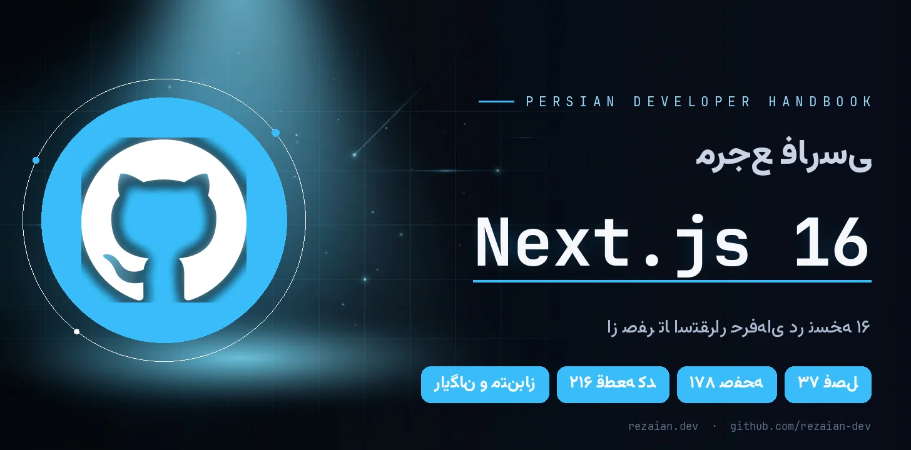
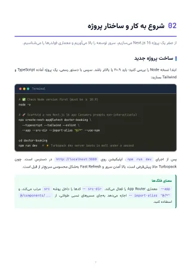

<a id="top"></a>

<p align="center">
  
</p>

<p align="center" dir="rtl">
  <strong>🎉 راهنمای کامل Next.js 16 به زبان فارسی — رایگان و بدون محدودیت</strong>
</p>

<p align="center">
  <a href="https://rezaian-dev.github.io/nextjs-16-persian-guide/"></a>
  <a href="./docs/pdf/Nextjs16-Persian-Guide.pdf"></a>
  <a href="./docs/pdf/Nextjs16-Persian-Guide.epub"></a>
</p>

<p align="center">
  
  
  
  
  
  
</p>

---

<div dir="rtl">

## ✨ این راهنما چیست؟

> **مرجع فارسی، پروژه‌محور و به‌روز Next.js 16** — از اولین `page.tsx` تا استقرار در Production.

Next.js 16 دنیای خودش را دارد: **Cache Components**، رندر سروری عمیق، `proxy.ts` و React 19.2. این کتاب همان‌هایی را — برای اولین بار به فارسی — با **زبان ساده، مدل ذهنی درست و کد واقعی** توضیح می‌دهد.

اینجا قرار نیست فهرست APIها را حفظ کنید؛ قرار است یاد بگیرید مثل یک مهندس ارشد **فکر کنید، تصمیم بگیرید و معماری بچینید**. 🧠

## 👥 برای چه کسی؟

<table dir="rtl" align="center">
<tr><th align="center">🎯 اگر شما…</th><th align="right">📦 این کتاب به شما می‌دهد</th></tr>
<tr><td align="center">تازه وارد دنیای Next.js شده‌اید</td><td>مسیر یادگیری گام‌به‌گام از صفر تا اولین اپ کامل</td></tr>
<tr><td align="center">با نسخه‌های قبلی کار کرده‌اید</td><td>نقشهٔ ارتقای دقیق به ۱۶ و تازه‌های Cache Components</td></tr>
<tr><td align="center">دنبال سطح ارشد هستید</td><td>معماری، امنیت، تست، کارایی و الگوهای Production</td></tr>
<tr><td align="center">در مسیر استخدام هستید</td><td>۱۰۰+ پرسش مصاحبه با پاسخ تشریحی و واژه‌نامهٔ تخصصی</td></tr>
</table>

## 💎 چرا این کتاب متفاوت است؟

- ⚡ **همگام با نسخهٔ ۱۶** — Cache Components، `use cache`، `cacheLife`، `cacheTag`، Turbopack و `proxy.ts`
- 🧠 **تمرکز بر «چرا»** — درک رفتار فریم‌ورک به‌جای حفظ‌کردن سینتکس
- 💻 **کد واقعی، نه اسلایدهای تئوری** — ۲۱۶ پنجرهٔ کد TypeScript و ترمینال
- 🛠️ **یادگیری با دست** — یک مینی‌بالگ کامل + ۸ مینی‌پروژهٔ کارگاهی
- 🔐 **Production از روز اول** — احراز هویت، RBAC، امنیت، Rate Limit، Docker و Core Web Vitals
- 🇮🇷 **فارسی روان، اصطلاح‌ها دوزبانه** — با واژه‌نامهٔ فارسی–انگلیسی پایان کتاب

## 🗺️ مسیر کتاب در یک نگاه

<table dir="rtl" align="center">
<tr><th align="center">🌱 بنیادها<br><sub>فصل ۱–۱۶</sub></th><th align="center">🏗️ معماری و Production<br><sub>فصل ۱۷–۳۲</sub></th><th align="center">🛠️ کارگاه<br><sub>فصل ۳۳–۳۵</sub></th><th align="center">🎓 مرجع شغلی<br><sub>فصل ۳۶–۳۷</sub></th></tr>
<tr><td align="center">App Router، RSC، داده،<br>کشینگ و اولین اپ کامل</td><td align="center">رندر، امنیت، فرم، سئو،<br>تست و استقرار</td><td align="center">۸ مینی‌پروژه،<br>نکات طلایی و بهترین شیوه‌ها</td><td align="center">پرسش‌های مصاحبه<br>و واژه‌نامهٔ فارسی–انگلیسی</td></tr>
</table>

<sub>💡 مسیر پیشنهادی همین ترتیب است؛ اما اگر تجربه دارید، هر فصل مستقل هم خوانده می‌شود. [فهرست کامل فصل‌ها ↓](#chapters)</sub>

<a id="preview"></a>

## 🖼️ نگاهی به داخل کتاب

<p align="center">
  <a href="./assets/readme/page-toc.png"></a>
  <a href="./assets/readme/page-chapter.png"></a>
  <a href="./assets/readme/page-code.png"></a>
  <a href="./assets/readme/page-workshop.png"></a>
</p>

## 📦 در چه قالبی می‌خواهید؟

<table dir="rtl" align="center">
<tr><th align="center">قالب</th><th align="center">مناسب برای</th><th align="center">لینک</th></tr>
<tr><td align="center">🌐 <strong>آنلاین</strong></td><td>مطالعهٔ فوری در مرورگر با پیوند مستقیم به هر فصل</td><td align="center"><a href="https://rezaian-dev.github.io/nextjs-16-persian-guide/book/"><strong>شروع مطالعه</strong></a></td></tr>
<tr><td align="center">📕 <strong>PDF</strong></td><td>دانلود، جست‌وجو و چاپ — قطع A4 رنگی</td><td align="center"><a href="./docs/pdf/Nextjs16-Persian-Guide.pdf"><strong>دانلود</strong></a></td></tr>
<tr><td align="center">📗 <strong>EPUB</strong></td><td>موبایل، تبلت و کتاب‌خوان</td><td align="center"><a href="./docs/pdf/Nextjs16-Persian-Guide.epub"><strong>دانلود</strong></a></td></tr>
<tr><td align="center">🧰 <strong>سورس</strong></td><td>کد سایت و ابزارهای ساخت کتاب</td><td align="center"><a href="https://github.com/rezaian-dev/nextjs-16-persian-guide"><strong>همین مخزن</strong></a></td></tr>
</table>

<a id="chapters"></a>

📚 **فهرست کامل ۳۷ فصل** — چهار بخش؛ هر بخش را جدا باز کنید:

<details>
<summary><strong>🌱 بخش اول — بنیادها و اولین اپ</strong> · فصل‌های ۱ تا ۱۶</summary>

1. [معرفی Next.js 16 و تازه‌های نسخه](https://rezaian-dev.github.io/nextjs-16-persian-guide/book/#ch-01) — ص ۵
2. [شروع به کار و ساختار پروژه](https://rezaian-dev.github.io/nextjs-16-persian-guide/book/#ch-02) — ص ۷
3. [نقشه راه یادگیری](https://rezaian-dev.github.io/nextjs-16-persian-guide/book/#ch-03) — ص ۹
4. [روتینگ فایل‌محور (App Router)](https://rezaian-dev.github.io/nextjs-16-persian-guide/book/#ch-04) — ص ۱۱
5. [Layout، فایل‌های ویژه و Metadata](https://rezaian-dev.github.io/nextjs-16-persian-guide/book/#ch-05) — ص ۱۹
6. [پیوند و ناوبری](https://rezaian-dev.github.io/nextjs-16-persian-guide/book/#ch-06) — ص ۲۳
7. [Server Components و Client Components](https://rezaian-dev.github.io/nextjs-16-persian-guide/book/#ch-07) — ص ۲۹
8. [واکشی داده و Streaming](https://rezaian-dev.github.io/nextjs-16-persian-guide/book/#ch-08) — ص ۳۶
9. [کشینگ مدرن با Cache Components](https://rezaian-dev.github.io/nextjs-16-persian-guide/book/#ch-09) — ص ۴۵
10. [Server Actions و تغییر داده](https://rezaian-dev.github.io/nextjs-16-persian-guide/book/#ch-10) — ص ۵۱
11. [Route Handlers (مبانی API)](https://rezaian-dev.github.io/nextjs-16-persian-guide/book/#ch-11) — ص ۵۶
12. [Middleware؛ جانشین proxy.ts](https://rezaian-dev.github.io/nextjs-16-persian-guide/book/#ch-12) — ص ۶۰
13. [استایل‌دهی با Tailwind v4](https://rezaian-dev.github.io/nextjs-16-persian-guide/book/#ch-13) — ص ۶۲
14. [بهینه‌سازی: تصویر، فونت، لینک و سئو](https://rezaian-dev.github.io/nextjs-16-persian-guide/book/#ch-14) — ص ۶۴
15. [محیط، TypeScript و استقرار](https://rezaian-dev.github.io/nextjs-16-persian-guide/book/#ch-15) — ص ۶۶
16. [پروژه عملی: مینی‌بالگ کامل](https://rezaian-dev.github.io/nextjs-16-persian-guide/book/#ch-16) — ص ۷۰

</details>

<details>
<summary><strong>🏗️ بخش دوم — معماری و Production</strong> · فصل‌های ۱۷ تا ۳۲</summary>

17. [معماری پروژه، ساختار پوشه و Clean Code](https://rezaian-dev.github.io/nextjs-16-persian-guide/book/#ch-17) — ص ۷۴
18. [استراتژی‌های رندر: SSG، ISR، SSR و PPR](https://rezaian-dev.github.io/nextjs-16-persian-guide/book/#ch-18) — ص ۷۸
19. [API‌نویسی کامل با Route Handlers](https://rezaian-dev.github.io/nextjs-16-persian-guide/book/#ch-19) — ص ۸۴
20. [خطاهای Hydration — مرجع کامل](https://rezaian-dev.github.io/nextjs-16-persian-guide/book/#ch-20) — ص ۹۴
21. [احراز هویت و کنترل دسترسی](https://rezaian-dev.github.io/nextjs-16-persian-guide/book/#ch-21) — ص ۱۰۲
22. [امنیت اپلیکیشن — فصل کامل](https://rezaian-dev.github.io/nextjs-16-persian-guide/book/#ch-22) — ص ۱۰۶
23. [فرم‌ها و اعتبارسنجی پیشرفته](https://rezaian-dev.github.io/nextjs-16-persian-guide/book/#ch-23) — ص ۱۱۲
24. [مدیریت state و داده در کلاینت](https://rezaian-dev.github.io/nextjs-16-persian-guide/book/#ch-24) — ص ۱۱۷
25. [تسلط بر کشینگ: لایه‌ها و باطل‌سازی](https://rezaian-dev.github.io/nextjs-16-persian-guide/book/#ch-25) — ص ۱۲۱
26. [کارایی و Core Web Vitals](https://rezaian-dev.github.io/nextjs-16-persian-guide/book/#ch-26) — ص ۱۲۵
27. [Metadata و سئو — کامل](https://rezaian-dev.github.io/nextjs-16-persian-guide/book/#ch-27) — ص ۱۲۸
28. [TypeScript پیشرفته و امنیت تایپ](https://rezaian-dev.github.io/nextjs-16-persian-guide/book/#ch-28) — ص ۱۳۲
29. [مدیریت خطا — کامل](https://rezaian-dev.github.io/nextjs-16-persian-guide/book/#ch-29) — ص ۱۳۵
30. [تست‌نویسی](https://rezaian-dev.github.io/nextjs-16-persian-guide/book/#ch-30) — ص ۱۳۹
31. [استقرار حرفه‌ای و Self-Hosting](https://rezaian-dev.github.io/nextjs-16-persian-guide/book/#ch-31) — ص ۱۴۲
32. [مهاجرت و ارتقا به نسخه ۱۶](https://rezaian-dev.github.io/nextjs-16-persian-guide/book/#ch-32) — ص ۱۴۶

</details>

<details>
<summary><strong>🛠️ بخش سوم — کارگاه و تثبیت</strong> · فصل‌های ۳۳ تا ۳۵</summary>

33. [نکات و ترفندهای طلایی](https://rezaian-dev.github.io/nextjs-16-persian-guide/book/#ch-33) — ص ۱۴۹
34. [کارگاه مینی‌پروژه‌ها](https://rezaian-dev.github.io/nextjs-16-persian-guide/book/#ch-34) — ص ۱۵۵
35. [بهترین شیوه‌ها، اشتباهات رایج و منابع](https://rezaian-dev.github.io/nextjs-16-persian-guide/book/#ch-35) — ص ۱۷۲

</details>

<details>
<summary><strong>🎓 بخش چهارم — مرجع و آمادگی شغلی</strong> · فصل‌های ۳۶ تا ۳۷</summary>

36. [پرسش‌های مصاحبه (Junior تا Senior)](https://rezaian-dev.github.io/nextjs-16-persian-guide/book/#ch-36) — ص ۱۷۴
37. [واژه‌نامه فارسی–انگلیسی](https://rezaian-dev.github.io/nextjs-16-persian-guide/book/#ch-37) — ص ۱۷۶

</details>

<a id="quickstart"></a>

## 🚀 دو قدم تا شروع

۱. **سریع‌ترین راه:** کتاب را همان [نسخهٔ آنلاین](https://rezaian-dev.github.io/nextjs-16-persian-guide/book/) بخوانید — نصب لازم نیست. ⚡

۲. **اگر سورس را می‌خواهید:**

```bash
git clone https://github.com/rezaian-dev/nextjs-16-persian-guide.git
cd nextjs-16-persian-guide && npm install && npm run dev
```

#### 🛠️ بیلد و ساختار پروژه (Next.js + TypeScript)


```bash
# توسعه
npm install      # نصب وابستگی‌ها
npm run dev      # سرور توسعه روی localhost:3000

# بیلد
npm run typecheck    # بررسی تایپ‌ها
npm run build        # بیلد استاندارد (Vercel / Node)
npm run build:pages  # خروجی استاتیک در out/ با basePath (برای GitHub Pages)
```

```text
src/app/          صفحه‌ها و layout (خانه، فصل‌ها، نسخهٔ آنلاین، سوشال‌کارت)
src/app/book/     روت نسخهٔ آنلاین کتاب + استایل ریدر
src/components/   کامپوننت‌های رابط کاربری (بخش‌ها، ریدر، بنر)
src/lib/          داده فصل‌ها، طرح کتاب و پیوندها
src/fonts/        فونت‌های وزیرمتن و جت‌برینز (woff2)
public/           دارایی‌ها، PDF، EPUB و صفحه‌های نسخهٔ آنلاین
public/book/      تصویر صفحه‌های کتاب (۱۷۸ صفحه)
docs/             خروجی منتشرشده روی GitHub Pages (ساختهٔ build:pages)
```


## 🧩 مجموعهٔ کامل راهنماهای فارسی

چهار مرجع، یک مسیر هماهنگ برای فرانت‌اند مدرن:

<table dir="rtl" align="center">
<tr><th align="right">راهنما</th><th align="center">موضوع</th><th align="center">لینک‌ها</th></tr>
<tr><td>🌱 <a href="https://github.com/rezaian-dev/git-github-persian-guide"><strong>Git و GitHub ۲۰۲۶</strong></a></td><td align="center">نسخه‌بندی، VS Code و همکاری</td><td align="center"><a href="https://rezaian-dev.github.io/git-github-persian-guide/">آنلاین</a></td></tr>
<tr><td>🟨 <a href="https://github.com/rezaian-dev/javascript-persian-guide"><strong>JavaScript ES2025</strong></a></td><td align="center">زبان و مدل ذهنی</td><td align="center"><a href="https://rezaian-dev.github.io/javascript-persian-guide/">آنلاین</a></td></tr>
<tr><td>⚛️ <a href="https://github.com/rezaian-dev/react-19-persian-guide"><strong>React 19.2</strong></a></td><td align="center">رابط کاربری، state و معماری</td><td align="center"><a href="https://rezaian-dev.github.io/react-19-persian-guide/">آنلاین</a></td></tr>
<tr><td>▲ <a href="https://github.com/rezaian-dev/nextjs-16-persian-guide"><strong>Next.js 16</strong></a></td><td align="center">فریم‌ورک، رندر سرور و استقرار</td><td align="center"><a href="https://rezaian-dev.github.io/nextjs-16-persian-guide/">آنلاین</a> · 📍 <strong>همین کتاب</strong></td></tr>
</table>

## 🤝 مشارکت

خطایی دیدید؟ پیشنهادی دارید؟ یک [Issue](https://github.com/rezaian-dev/nextjs-16-persian-guide/issues) باز کنید 🐛 — PRهای کوچک و متمرکز هم همیشه خوش‌آمدند. 🙏

## ✍️ نویسنده و مجوز

**محمدرضا رضائیان** — [@rezaian-dev](https://github.com/rezaian-dev)

این اثر با مجوز [Creative Commons BY-NC-SA 4.0](./LICENSE) منتشر شده است: استفاده و بازنشر غیرتجاری با ذکر منبع آزاد است و نسخهٔ اقتباسی باید با همین مجوز منتشر شود. ⚖️

</div>

---

<p align="center" dir="rtl">
  ⭐ اگر این راهنما برایتان مفید بود، با ثبت یک ستاره از ادامهٔ راه مجموعه حمایت کنید.
  <br>
  <a href="#top">بازگشت به بالا ↑</a>
</p>
