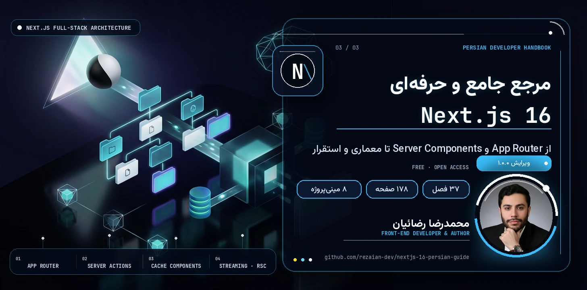

<a id="top"></a>

<p align="center">
  
</p>

<p align="center" dir="rtl">
  <strong>🚀 از App Router و Server Components تا معماری و استقرار</strong>
  <br>
  راهنمای فارسی و پروژه‌محور Next.js 16 — با تمرکز بر رندر سرور، Cache Components، Server Actions، امنیت، تست و Production.
</p>

<p align="center">
  <a href="https://rezaian-dev.github.io/nextjs-16-persian-guide/"></a>
  <a href="./docs/pdf/Nextjs16-Persian-Guide.pdf"></a>
  <a href="./docs/pdf/Nextjs16-Persian-Guide.epub"></a>
</p>

<p align="center">
  
  
  
  
  
</p>

<p align="center" dir="rtl">
  <a href="#about">🧭 درباره</a> ·
  <a href="#path">🗺️ مسیر یادگیری</a> ·
  <a href="#chapters">📚 فهرست فصل‌ها</a> ·
  <a href="#preview">🖼️ پیش‌نمایش</a> ·
  <a href="#editions">📦 نسخه‌ها</a> ·
  <a href="#build">🛠️ ساخت از سورس</a> ·
  <a href="#collection">🧩 مجموعه</a>
</p>

---

<div dir="rtl">

<a id="about"></a>

## 🧭 دربارهٔ راهنما

مرجع فارسی **Next.js 16** در **۳۷ فصل**؛ از App Router و Server Components تا Cache Components، امنیت، تست، Core Web Vitals و استقرار. نسخهٔ آنلاین، PDF و EPUB — همه رایگان.

اینجا قرار نیست فهرستی از APIها حفظ کنید. تمرکز راهنما بر **مدل ذهنی، رفتار فریم‌ورک و تصمیم‌گیری فنی** است: مسئله را درست بفهمید، راه‌حل‌ها را ارزیابی کنید و کدی بنویسید که در پروژهٔ واقعی دوام بیاورد.

### ✨ ویژگی‌ها

- 🧠 **مدل ذهنی App Router** — مرز سرور و کلاینت، رندر، Streaming و Hydration؛ با تمرکز بر «چرا»ی تصمیم‌های فریم‌ورک.
- ⚡ **همگام با Next.js 16** — Cache Components، `use cache`، `cacheLife`، `cacheTag`، Turbopack، `proxy.ts` و React 19.2.
- 💻 **کد TypeScript و پروژهٔ واقعی** — ۲۱۶ پنجرهٔ کد و ترمینال، یک مینی‌بالگ کامل و ۸ مینی‌پروژه برای تمرین مرحله‌ای.
- 🏗️ **معماری و داده** — ساختار feature-based، DAL، Route Handlers، Server Actions، مدیریت state و اعتبارسنجی.
- 🔐 **Production از روز اول** — احراز هویت، RBAC، امنیت، Rate Limit، تست، Core Web Vitals، Docker و Self-Hosting.
- 🔄 **مهاجرت و مرجع سریع** — مسیر ارتقا به نسخهٔ ۱۶، خطاهای رایج، پرسش‌های مصاحبه و واژه‌نامهٔ فارسی–انگلیسی.

<a id="path"></a>

## 🗺️ مسیر یادگیری

### 🌱 مرحلهٔ ۱ — بنیادها و اولین اپ

**فصل‌های ۱ تا ۱۶** — راه‌اندازی، App Router، Layout، RSC، واکشی داده، Streaming، کشینگ، Server Actions و پروژهٔ مینی‌بالگ.

🎯 **دستاورد:** ساخت مدل ذهنی و درک رفتار پایه

### 🏗️ مرحلهٔ ۲ — معماری و Production

**فصل‌های ۱۷ تا ۳۲** — رندر، API، Hydration، احراز هویت، امنیت، فرم، کشینگ پیشرفته، سئو، تست، استقرار و مهاجرت.

🎯 **دستاورد:** تسلط بر الگوها و قابلیت‌های مدرن

### 🛠️ مرحلهٔ ۳ — کارگاه و تثبیت

**فصل‌های ۳۳ تا ۳۵** — نکات طلایی، کارگاه ۸ مینی‌پروژه و مرور بهترین شیوه‌ها و اشتباهات رایج.

🎯 **دستاورد:** طراحی کد پایدار و قابل نگهداری

### 🎓 مرحلهٔ ۴ — مرجع و آمادگی شغلی

**فصل‌های ۳۶ تا ۳۷** — پرسش‌های مصاحبه با پاسخ دقیق و واژه‌نامهٔ فارسی–انگلیسی برای مرور سریع.

🎯 **دستاورد:** تثبیت آموخته‌ها و آمادگی پروژه

> 💡 برای مطالعهٔ پیوسته از مرحلهٔ اول شروع کنید. اگر تجربهٔ عملی دارید، مستقیم بروید سراغ مرحله‌ای که الان به آن نیاز دارید.

<a id="chapters"></a>

## 📚 فهرست فصل‌ها

فهرست کامل در چهار بخش جمع شده تا صفحه خلوت بماند؛ هر بخش را باز کنید. 🔍

<details>
<summary><strong>🌱 بخش اول — بنیادها و اولین اپ</strong> · فصل‌های ۱ تا ۱۶</summary>

1. [معرفی Next.js 16 و تازه‌های نسخه](https://rezaian-dev.github.io/nextjs-16-persian-guide/book/#ch-01) — صفحهٔ ۵
2. [شروع به کار و ساختار پروژه](https://rezaian-dev.github.io/nextjs-16-persian-guide/book/#ch-02) — صفحهٔ ۷
3. [نقشه راه یادگیری](https://rezaian-dev.github.io/nextjs-16-persian-guide/book/#ch-03) — صفحهٔ ۹
4. [روتینگ فایل‌محور (App Router)](https://rezaian-dev.github.io/nextjs-16-persian-guide/book/#ch-04) — صفحهٔ ۱۱
5. [Layout، فایل‌های ویژه و Metadata](https://rezaian-dev.github.io/nextjs-16-persian-guide/book/#ch-05) — صفحهٔ ۱۹
6. [پیوند و ناوبری](https://rezaian-dev.github.io/nextjs-16-persian-guide/book/#ch-06) — صفحهٔ ۲۳
7. [Server Components و Client Components](https://rezaian-dev.github.io/nextjs-16-persian-guide/book/#ch-07) — صفحهٔ ۲۹
8. [واکشی داده و Streaming](https://rezaian-dev.github.io/nextjs-16-persian-guide/book/#ch-08) — صفحهٔ ۳۶
9. [کشینگ مدرن با Cache Components](https://rezaian-dev.github.io/nextjs-16-persian-guide/book/#ch-09) — صفحهٔ ۴۵
10. [Server Actions و تغییر داده](https://rezaian-dev.github.io/nextjs-16-persian-guide/book/#ch-10) — صفحهٔ ۵۱
11. [Route Handlers (مبانی API)](https://rezaian-dev.github.io/nextjs-16-persian-guide/book/#ch-11) — صفحهٔ ۵۶
12. [Middleware؛ جانشین proxy.ts](https://rezaian-dev.github.io/nextjs-16-persian-guide/book/#ch-12) — صفحهٔ ۶۰
13. [استایل‌دهی با Tailwind v4](https://rezaian-dev.github.io/nextjs-16-persian-guide/book/#ch-13) — صفحهٔ ۶۲
14. [بهینه‌سازی: تصویر، فونت، لینک و سئو](https://rezaian-dev.github.io/nextjs-16-persian-guide/book/#ch-14) — صفحهٔ ۶۴
15. [محیط، TypeScript و استقرار](https://rezaian-dev.github.io/nextjs-16-persian-guide/book/#ch-15) — صفحهٔ ۶۶
16. [پروژه عملی: مینی‌بالگ کامل](https://rezaian-dev.github.io/nextjs-16-persian-guide/book/#ch-16) — صفحهٔ ۷۰

</details>

<details>
<summary><strong>🏗️ بخش دوم — معماری و Production</strong> · فصل‌های ۱۷ تا ۳۲</summary>

17. [معماری پروژه، ساختار پوشه و Clean Code](https://rezaian-dev.github.io/nextjs-16-persian-guide/book/#ch-17) — صفحهٔ ۷۴
18. [استراتژی‌های رندر: SSG، ISR، SSR و PPR](https://rezaian-dev.github.io/nextjs-16-persian-guide/book/#ch-18) — صفحهٔ ۷۸
19. [API‌نویسی کامل با Route Handlers](https://rezaian-dev.github.io/nextjs-16-persian-guide/book/#ch-19) — صفحهٔ ۸۴
20. [خطاهای Hydration — مرجع کامل](https://rezaian-dev.github.io/nextjs-16-persian-guide/book/#ch-20) — صفحهٔ ۹۴
21. [احراز هویت و کنترل دسترسی](https://rezaian-dev.github.io/nextjs-16-persian-guide/book/#ch-21) — صفحهٔ ۱۰۲
22. [امنیت اپلیکیشن — فصل کامل](https://rezaian-dev.github.io/nextjs-16-persian-guide/book/#ch-22) — صفحهٔ ۱۰۶
23. [فرم‌ها و اعتبارسنجی پیشرفته](https://rezaian-dev.github.io/nextjs-16-persian-guide/book/#ch-23) — صفحهٔ ۱۱۲
24. [مدیریت state و داده در کلاینت](https://rezaian-dev.github.io/nextjs-16-persian-guide/book/#ch-24) — صفحهٔ ۱۱۷
25. [تسلط بر کشینگ: لایه‌ها و باطل‌سازی](https://rezaian-dev.github.io/nextjs-16-persian-guide/book/#ch-25) — صفحهٔ ۱۲۱
26. [کارایی و Core Web Vitals](https://rezaian-dev.github.io/nextjs-16-persian-guide/book/#ch-26) — صفحهٔ ۱۲۵
27. [Metadata و سئو — کامل](https://rezaian-dev.github.io/nextjs-16-persian-guide/book/#ch-27) — صفحهٔ ۱۲۸
28. [TypeScript پیشرفته و امنیت تایپ](https://rezaian-dev.github.io/nextjs-16-persian-guide/book/#ch-28) — صفحهٔ ۱۳۲
29. [مدیریت خطا — کامل](https://rezaian-dev.github.io/nextjs-16-persian-guide/book/#ch-29) — صفحهٔ ۱۳۵
30. [تست‌نویسی](https://rezaian-dev.github.io/nextjs-16-persian-guide/book/#ch-30) — صفحهٔ ۱۳۹
31. [استقرار حرفه‌ای و Self-Hosting](https://rezaian-dev.github.io/nextjs-16-persian-guide/book/#ch-31) — صفحهٔ ۱۴۲
32. [مهاجرت و ارتقا به نسخه ۱۶](https://rezaian-dev.github.io/nextjs-16-persian-guide/book/#ch-32) — صفحهٔ ۱۴۶

</details>

<details>
<summary><strong>🛠️ بخش سوم — کارگاه و تثبیت</strong> · فصل‌های ۳۳ تا ۳۵</summary>

33. [نکات و ترفندهای طلایی](https://rezaian-dev.github.io/nextjs-16-persian-guide/book/#ch-33) — صفحهٔ ۱۴۹
34. [کارگاه مینی‌پروژه‌ها](https://rezaian-dev.github.io/nextjs-16-persian-guide/book/#ch-34) — صفحهٔ ۱۵۵
35. [بهترین شیوه‌ها، اشتباهات رایج و منابع](https://rezaian-dev.github.io/nextjs-16-persian-guide/book/#ch-35) — صفحهٔ ۱۷۲

</details>

<details>
<summary><strong>🎓 بخش چهارم — مرجع و آمادگی شغلی</strong> · فصل‌های ۳۶ تا ۳۷</summary>

36. [پرسش‌های مصاحبه (Junior تا Senior)](https://rezaian-dev.github.io/nextjs-16-persian-guide/book/#ch-36) — صفحهٔ ۱۷۴
37. [واژه‌نامه فارسی–انگلیسی](https://rezaian-dev.github.io/nextjs-16-persian-guide/book/#ch-37) — صفحهٔ ۱۷۶

</details>

<a id="preview"></a>

## 🖼️ پیش‌نمایش

<p align="center">
  <a href="./assets/readme/page-toc.png"></a>
  <a href="./assets/readme/page-chapter.png"></a>
  <a href="./assets/readme/page-code.png"></a>
  <a href="./assets/readme/page-workshop.png"></a>
</p>

<a id="editions"></a>

## 📦 نسخه‌های در دسترس

### 🌐 ONLINE — [نسخهٔ آنلاین](https://rezaian-dev.github.io/nextjs-16-persian-guide/book/)

**۱۷۸ صفحه · ۳۷ فصل** — کل کتاب در مرورگر و بدون دانلود؛ با فهرست فصل‌ها و پیوند مستقیم به هر فصل (مثل [فصل ۲۳](https://rezaian-dev.github.io/nextjs-16-persian-guide/book/#ch-23)).

### 📕 PDF — [نسخهٔ اصلی](./docs/pdf/Nextjs16-Persian-Guide.pdf)

**۱۷۸ صفحه · قطع A4** — رنگی، قابل جست‌وجو و دارای فهرست داخلی؛ مناسب دسکتاپ و تبلت.

### 📗 EPUB — [نسخهٔ کتاب‌خوان](./docs/pdf/Nextjs16-Persian-Guide.epub)

**۱۷۸ صفحه** — همان صفحه‌های کتاب، فصل‌بندی‌شده برای موبایل، تبلت و اپ‌های مطالعهٔ EPUB. صفحه‌ها تصویری‌اند، نه متن بازچینش‌پذیر.

### 🧰 GITHUB — [سورس و ابزارها](https://github.com/rezaian-dev/nextjs-16-persian-guide)

**Next.js · Python · CC BY-NC-SA** — کد سایت، ابزارهای ساخت نسخه‌ها و اسکریپت‌های کنترل کیفیت، همه در همین مخزن.

<a id="build"></a>

## 🛠️ ساخت از سورس

این مخزن دو بخش دارد: **سایت** (اپ Next.js) و **ابزارهای ساخت کتاب** (پایتون).

### ⚡ سایت (Next.js 16)

```bash
git clone https://github.com/rezaian-dev/nextjs-16-persian-guide.git
cd nextjs-16-persian-guide

npm install
npm run dev          # http://localhost:3000
npm run typecheck    # بررسی تایپ‌ها
npm run build        # بیلد استاندارد (Vercel / Node)
npm run build:pages  # خروجی استاتیک برای GitHub Pages در out/
```

خروجی `build:pages` با `basePath` برابر `/nextjs-16-persian-guide` ساخته می‌شود؛ همان محتوا در پوشهٔ `docs/` منتشر می‌شود.

### 🐍 کتاب (PDF، EPUB و نسخهٔ آنلاین)

پیش‌نیاز: Python 3.10 یا جدیدتر.

```bash
python -m venv .venv
source .venv/bin/activate       # macOS / Linux
# .venv\Scripts\Activate.ps1   # Windows PowerShell

python -m pip install -r src/requirements.txt
python src/tools/build_edition.py   # PDF
python src/tools/build_epub.py      # EPUB
python src/tools/build_reader.py    # نسخهٔ آنلاین در public/book/
python src/tools/make_previews.py
python src/tools/make_shots.py
python src/tools/make_card.py
python src/tools/qa.py
```

### 🗂️ ساختار اصلی

```text
.
├── src/
│   ├── app/                    # صفحه‌ها و layout اپ Next.js
│   ├── components/             # کامپوننت‌های رابط کاربری
│   ├── lib/                    # داده فصل‌ها و پیوندها
│   ├── edition/chapters.json   # منبع ساختاری فصل‌ها
│   └── tools/                  # ساخت کتاب، پیش‌نمایش و QA
├── public/                     # دارایی‌ها، PDF، EPUB و نسخهٔ آنلاین
└── docs/                       # خروجی منتشرشده روی GitHub Pages
```

<a id="collection"></a>

## 🧩 مجموعه راهنماهای فارسی

چهار مرجع، یک مسیر هماهنگ: نسخه‌بندی و همکاری، زبان JavaScript، رابط کاربری React و فریم‌ورک Production با Next.js.

- 🌱 **[Git و GitHub ۲۰۲۶](https://github.com/rezaian-dev/git-github-persian-guide)** — نسخه‌بندی، VS Code و همکاری · [نسخه آنلاین](https://rezaian-dev.github.io/git-github-persian-guide/)
- 🟨 **[JavaScript ES2025](https://github.com/rezaian-dev/javascript-persian-guide)** — زبان و مدل ذهنی · [نسخه آنلاین](https://rezaian-dev.github.io/javascript-persian-guide/)
- ⚛️ **[React 19.2](https://github.com/rezaian-dev/react-19-persian-guide)** — رابط کاربری، state و معماری کامپوننت · [نسخه آنلاین](https://rezaian-dev.github.io/react-19-persian-guide/)
- ▲ **[Next.js 16](https://github.com/rezaian-dev/nextjs-16-persian-guide)** — فریم‌ورک، رندر سرور و استقرار · [نسخه آنلاین](https://rezaian-dev.github.io/nextjs-16-persian-guide/) — 📍 **همین راهنمایید**

## 🤝 مشارکت

برای گزارش خطا یا پیشنهاد اصلاح یک [Issue](https://github.com/rezaian-dev/nextjs-16-persian-guide/issues) باز کنید. Pull Requestها را کوچک و متمرکز نگه دارید و دلیل تغییر را شفاف توضیح دهید. 🙏

- 🐛 [گزارش یک مشکل](https://github.com/rezaian-dev/nextjs-16-persian-guide/issues)
- 👀 [مشاهده مخزن](https://github.com/rezaian-dev/nextjs-16-persian-guide)

## ✍️ نویسنده و مجوز

**محمدرضا رضائیان** — [@rezaian-dev](https://github.com/rezaian-dev)

این اثر با مجوز [Creative Commons BY-NC-SA 4.0](./LICENSE) منتشر شده است: استفاده و بازنشر غیرتجاری با ذکر منبع آزاد است و هر نسخهٔ اقتباسی باید با همین مجوز منتشر شود. ⚖️

</div>

---

<p align="center" dir="rtl">
  ⭐ اگر این راهنما برایتان مفید بود، با ثبت یک ستاره از ادامهٔ راه مجموعه حمایت کنید.
  <br>
  <a href="#top">بازگشت به بالا ↑</a>
</p>
